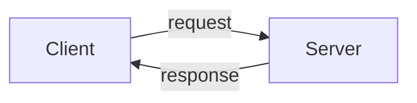

# Towards human-readable binary encodings

Can we make binary encodings "human-readable"? This post explores this question
by means of implementing a library inspired by Erlang's bit syntax.

## Motivation

JSON is probably the most commonly used format for serialising data today. A
frequent argument for using it is that JSON is human-readable.

What does that mean exactly? I suppose that people usually mean two things.
First, it's less verbose than XML, making it easier to read. Most people would
probably still call XML human-readable, but arguebly less so than JSON. Second,
it's easier to read than binary encodings produced by MessagePack, ASN.1 or
Protobuf, etc. For example, the JSON string `"foo"` is represented by the
following byte sequence when using MessagePack:

```
                 +------------ A string of length 3 consisting of ...
                 |  +--------- ... the character 'f', following by ...
                 |  |  +--+--- ... two 'o' characters.
                 |  |  |  |
                 v  v  v  v
                 a3 66 6f 6f
```

If we were to open a file with the above bytes or echo them to the terminal we'd
see `£foo`. Which, while one character shorter[^1] than the JSON string, is
starting to become unreadable already and it will become worse once the JSON
object is more complicated.

It's worth noting that all serialised data ends up being bytes once on disk or
sent over the network. So in a sense one could argue that the reason JSON is
human-readable, is because these bytes get displayed as ASCII or UTF-8 by our
editors and the standard terminal utilities. Another way to think about it is
that ASCII and UTF-8 are encodings as well, which would be unreadable without
tool support. This isn't a new argument, people like [Joe
Armstrong](https://youtu.be/ieEaaofM7uU?list=PL_aCdZH3eJJVki0YqHbJtqZKSmcbXH0jP&t=28)
and [Martin Thompson](https://youtu.be/qDhTjE0XmkE?t=2280) have separately and
on [multiple](https://youtu.be/rQIE22e0cW8?t=2003) occasions pointed this out.
Both stress that we are [wasting](https://youtu.be/bzDAYlpSbrM?t=1481) massive
amounts of CPU cycles on parsing JSON.

It's not just that it's less space efficient, as we saw with `"foo"` vs `£foo`,
it's also because with JSON we need to inspect every single character after the
first `"` in order to determine when the string ends, i.e. finding the closing
`"`. Whereas in, for example, the MessagePack case the length of the string is
encoded in the `a3` byte so we can jump forward and just copy the three bytes
(without looking at them). Joe calls this *reconstructing* as opposed to
parsing.

So if JSON is merely human-readable because of our application-level tooling,
this raises the question: what would it take to make binary encodings
"human-readable"?

For starters I think we'd need to make it easier to work with binary data in our
programming languages. I believe Erlang's bit syntax, which lets us do bit-level
pattern-matching, is a good example of what better language support for working
with binary data looks like. Even though Erlang's way ahead most programming
languages on this front, there are important use cases which are not possible to
express efficiently using bit syntax though, e.g. in-place updates, leaving more
to be desired.

In the rest of this post we'll have first have a look at how Erlang's bit syntax
works, then we'll turn to its shortcomings and try to start addressing them by
means of implementing a library.

## Erlang's bit syntax

Erlang has a feature called bit syntax which allows the user to encode and
decode data at the bit-level. Here's an example, where we encode three integers
into two bytes:

```erlang
1>​ Red = 2.
2
2>​ Green = 61.
61
3>​ Blue = 20.
20
4>​ Mem = <<Red:5, Green:6, Blue:5>>.
<<23,180>>
```

Normally, even the smallest integer takes up one byte (e.g. `char` in C or
`Int8` in Haskell) but Erlang's bit syntax lets us encode, e.g., `Red` using
only 5 bits (rather than the default 8 bits) and thus we can fit all three
integers in $5 + 6 + 5 = 16$ bits or two bytes.

We can also pattern match at the bit-level using sizes to get our integers back:

```erlang
5>​ <<R1:5, G1:6, B1:5>> = Mem.
<<23,180>>
6>​ R1.
2
7>​ G1.
61
8>​ B1.
20
```

For larger integer types, e.g. `0x12345678 :: Int32`, we can also specify the
byte order or [endianness](https://en.wikipedia.org/wiki/Endianness):

```erlang
1>​ {<<16#12345678:32/big>>,<<16#12345678:32/little>>,
​<<16#12345678:32/native>>,<<16#12345678:32>>}.
{<<18,52,86,120>>,<<120,86,52,18>>,
<<120,86,52,18>>,<<18,52,86,120>>}
```

For a slightly larger example, here's pattern-matching on an IP datagram of IP
protocol version 4:

```erlang
-define​(IP_VERSION, 4).
​-define​(IP_MIN_HDR_LEN, 5).

...
DgramSize = ​byte_size​(Dgram),
​case​ Dgram ​of
  <<?IP_VERSION:4, HLen:4, SrvcType:8, TotLen:16,
    ID:16, Flags:3, FragOff:13,
    TTL:8, Proto:8, HdrChkSum:16,
    SrcIP:32,
    DestIP:32, RestDgram/binary>> ​when​ HLen >= 5, 4*HLen =< DgramSize ->
        OptsLen = 4*(HLen - ?IP_MIN_HDR_LEN),
        <<Opts:OptsLen/binary,Data/binary>> = RestDgram,
        ...
```

Note how we can match on the header length, `HLen`, and later use the value of
that match as the size when pattern matching on later values.

## Usage

We can implement a library that lets us do similar things to Erlang's bit
syntax, but in a more clunky way (it's difficult to beat native syntax support).

```haskell
import BitsAndBobs

let
  pattern0    = sized word32 5 ::: sized word32 6 ::: sized word32 5 ::: Nil
  bytestring0 = byteString [2 :. sized word32 5, 61 :. sized word32 6, 20 :. sized word32 5]
bitMatch pattern0 bytestring0
  -- => (2,(61,(20,())))

let
  pattern1    = word8 :>>= \sz -> sized bytes sz ::: bytes ::: Nil
  bytestring1 = byteString [5 :. word8, "hello, rest" :. bytes]
bitMatch pattern1 bytestring1
  -- => (5,("hello",(", rest",())))
```

The above is
[implemented](https://github.com/stevana/bits-and-bobs/blob/main/src/BitsAndBobs.hs)
in Haskell, but should be straightforward to port to most languages using the
following recipe.

## How it works

The high-level idea when encoding a bunch of, possibly sized, values into a
`ByteString` is as follows:

  1. For each value convert the value into a list of booleans (or bits);
  2. If the value is sized then only take that many bits, otherwise if it isn't
     sized use the default value, e.g. `Int8` = 8 bits, `Float` = 32 bits, etc;
  3. Concatenate the lists of booleans for each value into a single list of
     booleans;
  4. Split the list in groups of 8 bits;
  5. Convert each 8 bits into a byte (`UInt8`);
  6. Create a `ByteString` from list of `UInt8`s.

For decoding or pattern-matching a, possibly sized, pattern against a
`ByteString` the idea is:

  1. Convert `ByteString` into list of booleans (or bits);
  2. For each pattern take its size many bits from the list;
  3. Convert the bits into the value type of the pattern;
  4. Continue matching the remaining patterns against the remaining bits.

`Float` and `Double`s get converted into `UInt32` and `UInt64` respectively
before converted into bits, and `Int`egers are encoding using
[zigzag](https://en.wikipedia.org/wiki/Variable-length_quantity#Zigzag_encoding)
encoding[^2].

## Extending Erlang's bit syntax

Erlang's bit syntax makes it possible to decode binary data into the host
languague's types, which can then be manipulated, and finally encoded back to
binary.

While already useful, it doesn't cover some interesting use cases. Let me try to
explain the use cases and at the same time sketch possible ways we can extend
Erlang's bit syntax to cover those.

### In-place updates

What if we merely want to update some binary in-place without reading it all in
and writing it all back out?

For example, the de facto standard for metadata format for mp3 files is called
[ID3](https://en.wikipedia.org/wiki/ID3). This was never part of the mp3
specification, but rather added afterwards and so in order to not break
backwards-compatibility with old media players they added it at the end of the
file.

Lets imagine we wanted to write a metadata editor for mp3 files using Erlang's
bit syntax. I think no matter how smart the Erlang run-time is about bit syntax,
it's hard to imagine that it wouldn't need to deserialse and serialise more data
than necessary. Worst case it would deserialise all of the audio that leads up
to where the metadata starts, but even if it's somehow clever and starts from
the back then we'd still probably need to at least deserialise all fields
preceding the field we want to update.

Inspired by this problem and how tools like [`poke`](https://jemarch.net/poke)
work, I've started another experiment based on `Schema`s with this use case in
mind, here's an example session of editing the metadata of an mp3 file:

```
$ cabal run mp3 -- /tmp/test.mp3

mp3> help
schema | read <field> | write <field> <value> | list | q(uit)

mp3> schema
audio   : Binary
header  : Magic "TAG"
title   : ByteString (Fixed 30)
artist  : ByteString (Fixed 30)
album   : ByteString (Fixed 30)
year    : ByteString (Fixed 4)
comment : ByteString (Fixed 30)
genre   : UInt8

mp3> read title
Unknown

mp3> write title "Bits and Bobs"

mp3> read title
Bits and Bobs

mp3> list
Right (Id3V1 {title = "Bits and Bobs", artist = "", album = "", year = "2023", comment = ""})
mp3> quit
```

The user needs to specify the `Schema`, which is closely mapped to the ID3v1
specficiation and the rest is provided by the library. In particular all the
offsets to the different fields are calculated from the schema[^3], which allow us
to jump straight to the field of interest and *reconstruct* it without parsing.
The above interactive [editor](app/Main.hs) is completely
[generic](src/BitsAndBobs/Editor.hs) and works for any `Schema`!

If we can read and update fields, it should also be possible to get
[diffs](https://youtu.be/MUb8rD5mPvE?list=PLTj8twuHdQz-JcX7k6eOwyVPDB8CyfZc8&t=830)
and patches for cheap.

### On-disk data structures

Now that we can edit files in-place on the disk it would be nice to use this in
order to implement on-disk data structures. For example imagine we'd like to do
some kind of logging. If our schemas could express arrays and records we could
define our log to be an a struct with a length field and an array of records
field that of size length. In addition to extending the schema with arrays and
records, we'd also need atomic increments of the length field so that we can in
a thread-safe manner allocate space in our array. B-trees or
[Aeron's](https://github.com/real-logic/aeron) [log
buffers](https://aeroncookbook.com/aeron/log-buffers-images/) would be other
interesting on-disk data structures to implement.

The generic editor would be useful for debugging and manipulating such data
structures, but we'd probably want more tooling. For logging we probably want
something like `cat` and `grep` but generic in `Schema`.

### Zero-copy

When we `read` a `ByteString` field in the mp3 metadata example above, we copied
the bytes from the underlying file. Sometimes we might want to avoid doing that.

For example imagine we are implementing some network protocol. We can use a
pre-allocated buffer and [`recv`](https://linux.die.net/man/2/recv) bytes from a
socket into this buffer (avoiding allocating memory while handling requests),
once the request is inside our buffer we can decode individual fields (without
parsing) and from that we can determine what kind of request it is. Let's
imagine it's some kind of write request where we want to save the payload of
some field to disk. It would be a waste to copy the bytestring of the payload
only to write it disk immediately after, since the network request consists of
raw bytes and that's what we want to write to the disk anyway. Instead we'd like
to be able to decode the payload field as a pointer/slice of the buffer which we
pass to [`write`](https://linux.die.net/man/2/write) (thus avoiding copying aka
"zero-copy").

### Backward- and forward-compatiability and migrations

Another big topic is schema evolution. How can we maintain backward- and
forward-compatibility as our software evolves? We probably want to be able to
migrate old formats into newer ones somehow also.

### Compression

Currently our schemas cannot express how to compress fields on disk, or how to
avoid sending unnecessary data in consecutive network messages.

An example of the former might be to compress a bytestring field, using say
[deflate](https://en.wikipedia.org/wiki/Deflate), before writing it to disk.
While an example of the former might be to only send the difference or change of
some integer field, instead of sending the whole integer again. To make things
more concrete, lets say the integer represents epoch time and we send messages
several times per second, then by only sending the difference or
[delta](https://en.wikipedia.org/wiki/Delta_encoding) in time since the last
message we can save space. Other examples of compression include
[dictionary](https://en.wikipedia.org/wiki/Dictionary_coder) compression,
[run-length encoding](https://en.wikipedia.org/wiki/Run-length_encoding), [bit
packing](https://en.wikipedia.org/wiki/Apache_Parquet#Bit_packing) and [Huffman
coding](https://en.wikipedia.org/wiki/Huffman_coding).

It would be neat if encoding and decoding fields could be done modulo
compression! Likewise the schema-based `cat` and `grep` could also work modulo
compression.

A related topic is storing our data in a row-based or columnar fashion. Take the
example of a logging library we discussed earlier with a schema that's an array
of records, i.e. each log call adds a new record to the array. This is nice in
terms of writing efficiency, but if we wanted to do a lot of grepping or some
aggregation on some field in the record then we'd have to jump around a lot in
the file (jumping over the other fields that we are not interested in). It could
be more efficient to restructure our data into a record of arrays instead, where
each array only has data from one field, that way searching or aggregating over
that field would be much more efficient (no jumping around). Some compression is
also a lot easier to apply on columnar data, e.g. delta and run-length encoding.
Perhaps it would make sense if the schema-based tools could do such data
transformations in order to optimise for reads or archiving?

### Checksums

If we can do encoding and decoding fields modulo compression, why not also
handle checksums transparently? When we update a field which is part of a
checksum, we'd probably want to check the checksum beforehand and recompute it
afterwards.

### Validation

What if some input bytes don't match the schema? Currently all magic tags in a
schema get verified, but sometimes we might want to be able to edit incomplete
or malformed inputs.

Can we add refinements to the schema which allow us to express things like,
integer between 18 and 150 or bytestring containing only alphanumeric
characters, etc?

### Protocols

So far we've looked at how to specify what data our programs use and how it's
transformed to and from bytes on disk or over the network. Another important
aspect is what protocol is followed when said data is sent between components in
the system.

For example consider some client-server application where our schema describes
the request and responses:



The schema doesn't say anything about in which order requests are legal. For
example, we might want to always requrie a login-like request at the start of a
session. Or let's say we are describing a POSIX-like filesystem API, then
`read`s and `write`s must only be made on `open` (and not yet `close`d) file
descriptors.

Joe Armstrong wrote a paper called [*Getting Erlang to talk to the outside
world*](https://erlang.org/workshop/2002/Armstrong.pdf) (2002) which discusses
this problem. He proposed a language for describing protocols and a dynamic
sessions type checker, it never seemed to have got much traction though even
though he gave several [talks](https://youtu.be/ed7A7r6DBsM?t=1071) about it.
One implementation can be found
[here](https://ubf.github.io/ubf/ubf-user-guide.en.html).

### Pandoc for binary encodings

There's this neat tool called [`pandoc`](https://github.com/jgm/pandoc) that
makes possible to convert between different text formats, e.g. from Markdown to
HTML.

The list of supported formats to convert from and to is pretty long. If we were
to convert to and from each pair of possibilities would require $O(N^2)$
[work](https://youtu.be/ed7A7r6DBsM?t=2311). So what `pandoc` does instead is to
convert each format to and from its internal abstract representation, thereby
reducing the problem to $O(N)$.

Could we do something similar for binary encodings?

In the book *Development and Deployment of Multiplayer Online Games, Vol. I* by
Sergey Ignatchenko (pp. 259-285, 2017) the author talks about how most
[IDLs](https://en.wikipedia.org/wiki/Interface_description_language), e.g.
Protobufs, have the same language for describing *what* the abstract data which
we want to serialise and *how* we actually want the data to be serialised. By
separating the two, we could change the binary format "on the wire" without
changing the application which operates on the abstract data (the *what* part).
A clearer separation between IDL and its encoding could perhaps be useful when
trying to solve the `pandoc` problem for binary.

Another way to think of this is: can we make a DSL for IDLs?

## Discussion

* Q: Why not just use [Protobuf](https://en.wikipedia.org/wiki/Protocol_Buffers)?

  A: Except for backward- and forward-compatibility, I don't think Protobufs can
     handle any of the above listed use cases. Also the way it handles
     compatibility with it's numbered and optional fields is quite ugly[^4].
* Q: Writing safely to disk without going via a database is almost impossible!?

  A: Dan Luu has [written](https://danluu.com/deconstruct-files/) about
  [this](https://danluu.com/fsyncgate/) on several
  [occasions](https://danluu.com/file-consistency/). Short answer: don't store
  anything you are worried about losing using this library. Longer answer: I'd
  like to revisit this topic from the point of view of testing at some later
  point in time. In particular I'm interested in how we can make the results
  from the paper [*All File Systems Are Not Created Equal: On the Complexity of
  Crafting Crash-Consistent
  Applications*](https://www.usenix.org/conference/osdi14/technical-sessions/presentation/pillai)
  (2014) more accessible, especially their tool [*ALICE: Application-Level
  Intelligent Crash Explorer*](https://github.com/madthanu/alice).

## Contributing

The current implementation is in Haskell, but I'd really like to encourage a
discussion beyond specific languages. In order to make binary "human-readable"
we need solutions that are universal, i.e. work in any language, or perhaps
better yet than libraries -- extend programming languages with something like
Erlang's bit syntax.

* Do you have use cases that are not listed above?
* Do you know of tools, libraries or solutions any of the above use cases that
  have already not been discussed or are not listed below in the "see also"
  section?
* Do you know if some use cases impossible in general or incompatible with each
  other?
* Interested in porting any of these ideas to your favorite language?

If so, feel free to get in touch!

## See also

* The Erlang reference manual on [bit
  syntax](https://www.erlang.org/doc/reference_manual/expressions.html#bit_syntax);
* Programming examples of bit syntax from the Erlang [user's
  guide](https://www.erlang.org/doc/programming_examples/bit_syntax.html);
* Joe Armstrong's PhD
  [thesis](http://kth.diva-portal.org/smash/record.jsf?pid=diva2%3A9492&dswid=-1166)
  (2003) also has a section on bit syntax on p. 60;
* [Native Code Compilation of Erlang's Bit
  Syntax](https://erlang.org/workshop/2002/Gustafsson.pdf) (2002);
* [Cap’n Proto](https://capnproto.org/);
* Simple Binary Encoding
  ([SBE](https://github.com/real-logic/simple-binary-encoding)) by Martin
  Thompson et al;
* GNU [poke](https://jemarch.net/poke), extensible editor for structured
  binary data;
* [fq: jq for binary formats](https://github.com/wader/fq) also described in
  this
  [talk](https://www.youtube.com/watch?v=GJOq_b0eb-s&list=PLTj8twuHdQz-JcX7k6eOwyVPDB8CyfZc8&index=1);
* [Terminal JSON viewer](https://github.com/antonmedv/fx);
* Rust's [binrw](https://github.com/jam1garner/binrw) crate;
* *Designing Data-Intensive Applications* by Martin Kleppmann (chapter 3-4,
  2017);
* *Development and Deployment of Multiplayer Online Games, Vol. I* by Sergey
   Ignatchenko (pp. 200-216 and 259-285, 2017).


[^1]: The savings are greater for more complicated JSON objects, especially
    considering JSON doesn't support binary data which needs to be either
    escaped or base64 encoded before used as a string.

[^2]: I don't think Erlang uses zig-zag encoding of integers, in fact I'm not
    sure what it does with them.
[^3]: The library tries to calculate the offset of a field from the start of the
    file, in this case the beginning of the file contains an audio binary "field"
    of unknown length, so it fails and retries calculating the offset from the
    end of the file instead.
[^4]: Avro has a nicer story for
    [compatibility](https://avro.apache.org/docs/1.11.1/specification/#schema-resolution).
